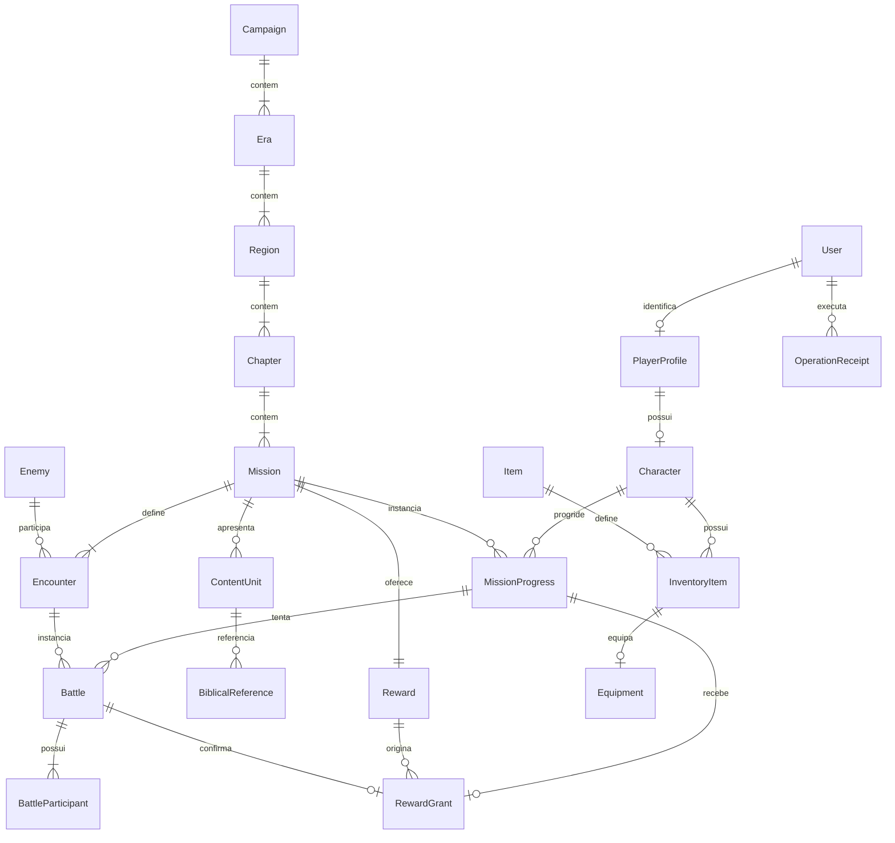

# Modelo de dados do MVP

> TASK-0006 — PRECEDÊNCIA: o vertical slice de Neemias está **SUPERSEDED**; o atual é **Gênesis 2–3 / O Jardim e a Escolha**. Este modelo da TASK-0004 é preservado como histórico técnico e requer revisão antes de implementar gameplay. Etapas fixas, batalha obrigatória, balanceamento e bloqueio global de missão não representam o produto atual. Consulte [impacto da dinâmica central](CENTRAL-DYNAMICS-IMPACT.md) para incompatibilidades, decisões preservadas e fontes oficiais. Nenhum schema foi alterado.

TASK-0004, 2026-09-16. Modelo conceitual para PostgreSQL/Drizzle, sem schema ou implementação. Gameplay vem de [MVP](../game-design/MVP.md), [personagem](../game-design/CHARACTER-SYSTEM.md), [batalha](../game-design/BATTLE-SYSTEM.md), [campanha](../game-design/CAMPAIGN-STRUCTURE.md) e [loop](../game-design/CORE-GAMEPLAY-LOOP.md). Invariantes normativas em [DATABASE-RULES](DATABASE-RULES.md); decisões de persistência em [ADR-0002](../adr/ADR-0002-progress-persistence.md).

## Convenções e fronteiras

IDs opacos gerados pelo servidor; PK em toda entidade persistida. IDs não são autorização. Campos obrigatórios são NOT NULL salvo indicação opcional. Timestamps são do servidor. Contadores são inteiros limitados pelo domínio, sem ponto flutuante. Código editorial é estável e distinto de ID técnico. Relações citadas são FKs; validações entre linhas explicitamente atribuídas à aplicação transacional não devem ser confundidas com CHECK simples.

User pertence a identidade/Better Auth. PlayerProfile pertence ao domínio de jogador. Character é o personagem. Nada de senha, sessão ou e-mail em tabelas de gameplay. O formato físico de identidade será definido pela biblioteca na tarefa de auth; não inventar esquema paralelo de credenciais.

Conteúdo é definição compartilhada, escrita somente pelo processo editorial autorizado. Estado pertence a um personagem e só muda via aplicação. Aplicação coordena uma transação entre missões, combate e inventário; engine calcula regras sem acessar banco; persistência implementa portas usando Drizzle; HTTP valida DTOs e sessão, sem expor entidades ORM. Não há um pacote por tabela, serviço adicional, event sourcing ou CMS.

## Identidade, personagem e projeções

| Entidade | Campos conceituais e responsabilidade | Relação, ownership e integridade |
| --- | --- | --- |
| User | id; identidade e estado da conta administrados por Better Auth | Um User tem zero ou um PlayerProfile; nenhum dado de gameplay autentica o usuário |
| PlayerProfile | id, user_id, created_at; âncora do jogador, sem duplicar e-mail/nome do personagem | user_id FK e UNIQUE; pertence a exatamente um User; zero ou um Character |
| Character | id, player_profile_id, pseudonym, portrait_key, xp_total, rules_version, version, created_at | player_profile_id FK e UNIQUE: um personagem por conta; pseudônimo privado 3–20 caracteres conforme design, sem unicidade global; XP ≥ 0; versão inteira ≥ 0 |
| CharacterStats | Projeção: level, max_hp, base_attack, base_defense, speed e atributos efetivos | Não criar tabela mutável. Derivar de xp_total + rules_version + Equipment. Nível 1/2/3 pelos limiares 0/100/300. Vida atual pertence a BattleParticipant |
| PlayerProgress | Projeção por Character e Campaign: missão atual, concluídas, disponíveis, capítulo/campanha concluídos, epílogo | Não criar tabela. Derivar MissionProgress e hierarquia. Ausência de progresso não significa desbloqueio: validar pré-requisito. Várias campanhas usam o mesmo personagem; somente uma missão ativa global no MVP |
| Inventory | Agregado lógico de Character: capacidade fixa 4 | Não criar linha 1:1 sem atributos próprios. Conteúdo é InventoryItem; equipamento continua ocupando um espaço |

Persistir xp_total evita agregar concessões a cada comando. RewardGrant fornece conferência: XP deve equivaler à soma de xp_amount concedidos (inicial zero). É redundância deliberada, alterada na mesma transação. Level/stats/desbloqueios não são cópias gravadas; são retornados e reconstruídos pelo engine. No conteúdo aprovado o máximo atingível é 300 XP; teto de nível 3. Novas campanhas com outras recompensas exigem revisão de balanceamento, sem precisar misturar identidade e conteúdo.

## Conteúdo compartilhado

| Entidade | Campos principais | Relações e constraints |
| --- | --- | --- |
| Campaign | id, code, title, content_version, rules_version, publication_status | code UNIQUE; contém 1..N Era quando publicada |
| Era | id, campaign_id, code, title, position | FK Campaign; UNIQUE(campaign_id, code) e (campaign_id, position) |
| Region | id, era_id, code, title, position | FK Era; UNIQUE(era_id, code) e (era_id, position) |
| Chapter | id, region_id, code, title, position | FK Region; UNIQUE(region_id, code) e (region_id, position) |
| Mission | id, chapter_id, code, title, position, prerequisite_mission_id opcional, challenge_spec | FK Chapter e self-FK de pré-requisito; UNIQUE(chapter_id, code/position), separadamente; challenge_spec pequeno, tipado por desafio aprovado, validado no servidor |
| Encounter | id, mission_id, position, enemy_id | FKs Mission e Enemy; UNIQUE(mission_id, position); MVP exige exatamente um encontro por missão publicada |
| Enemy | id, code, name, max_hp, attack, defense, speed, behavior_key, is_boss, canonical_status=FICTIONAL | code UNIQUE; HP > 0, demais atributos ≥ 0; behavior_key em allowlist do engine; 1 Enemy pode aparecer em vários Encounter |
| Boss | Papel de Enemy com is_boss=true e behavior_key específico | Sem tabela, herança ou prêmio adicional. E3 usa a mesma Battle |
| Item | id, code, name, slot opcional, attack_bonus, defense_bonus, canonical_status=FICTIONAL | code UNIQUE; slot HAND/PROTECTION ou nulo; catálogo I1/I2/I3, sem instâncias com durabilidade/raridade |
| Reward | id, mission_id, xp_amount, item_id opcional | mission_id FK UNIQUE; item_id FK Item; XP ≥ 0; exatamente um Reward por missão publicada. Zero ou um item basta ao MVP; não criar lista genérica de loot |

Posições são inteiros positivos. A aplicação editorial verifica hierarquia completa, pré-requisitos dentro da mesma campanha, ausência de ciclos e sequência M1→M2→M3; FK sozinha não prova esses fatos. Rascunhos podem estar incompletos e nunca são jogáveis.

Conteúdo publicado referenciado por progresso é imutável no MVP, incluindo itens/inimigos utilizados; não editar recompensas ou regras sob uma tentativa. MissionProgress fixa content_version e rules_version ao primeiro início; Battle herda ambas. As versões são identificadores de artefatos conservados no servidor, não strings arbitrárias do cliente. Não criar versão nova como outra missão para permitir pagamento repetido. Alterações de campanha já iniciada exigirão plano explícito de revisão/migração antes de publicação; não se implementa agora um editor de revisões. Novas campanhas têm IDs próprios, mesma hierarquia e mesmas tabelas de progresso; não acrescentar colunas C1/M1 ao personagem.

## Metadados bíblicos por unidade

Mission contém ContentUnit ordenadas, pois uma mesma cena mistura N canônico e F ficcional. Um rótulo global na campanha não pode tornar o treino canônico.

| Entidade adicional | Campos e integridade | Justificativa |
| --- | --- | --- |
| ContentUnit | id, mission_id, code, position, canonical_status, content_key, rationale opcional | FKs Mission; UNIQUE(mission_id, code/position), separadamente; canonical_status enum CANONICAL/INTERPRETATIVE/FICTIONAL; content_key identifica bloco original aprovado, não contém tradução integral |
| BiblicalReference | id, content_unit_id, book, chapter, verse_start, verse_end, translation_source, source_locator | FK ContentUnit; 0..N referências por unidade; UNIQUE(content_unit_id, book, chapter, verse_start, verse_end, translation_source); capítulo/versos > 0, fim ≥ início; livro em vocabulário controlado; source identifica edição/fonte consultada |

CANONICAL exige pelo menos uma referência conferida; INTERPRETATIVE exige justificativa e origem quando baseada em passagem; FICTIONAL exige justificativa, sem atribuir historicidade. São gates editoriais, não CHECK entre tabelas. Referências de capítulos distintos usam linhas distintas. Títulos/descrições de gameplay são ficcionais; material narrativo novo sempre passa por ContentUnit e revisão editorial. A unidade tem exatamente uma missão neste slice; reuso genérico não é necessário. Nenhum novo texto narrativo foi criado nesta tarefa.

Não há coluna para texto integral de tradução protegida nem importação de Bíblia. Modelo registra referências, fonte e chaves dos blocos aprovados. Edição portuguesa, licença e permissões de uso são pendência de produto antes da publicação; WEBP citada no design não concede automaticamente direitos de outras traduções.

## Estado do jogador e concessões

| Entidade | Campos conceituais | Ownership, cardinalidade e constraints |
| --- | --- | --- |
| MissionProgress | character_id, mission_id, status, stage opcional, narrative_cursor opcional, challenge_completed, content_version, rules_version, completed_at opcional | PK composta(character_id, mission_id), ambas FKs. status AVAILABLE/ACTIVE/COMPLETED; ausência de linha representa ainda não iniciada. UNIQUE parcial por character_id quando ACTIVE. Stage NARRATIVE/CHALLENGE/BATTLE; cursor referencia unidade da própria missão, verificado na transação |
| Battle | id, character_id, mission_id, encounter_id, attempt_number, status, round_number, version, content_version, rules_version, started_at, ended_at opcional | FK composta(character_id, mission_id)→MissionProgress; FK composta(encounter_id, mission_id)→Encounter(id, mission_id), com chave candidata correspondente. UNIQUE(character_id, mission_id, attempt_number); UNIQUE parcial character_id para status ACTIVE; status ACTIVE/VICTORY/DEFEAT/ABANDONED |
| BattleParticipant | battle_id, side, current_hp, initial_max_hp, initial_attack, initial_defense, initial_speed, precise_strike_used | PK(battle_id, side), FK Battle; side PLAYER/ENEMY. Exatamente dois participantes criados atomicamente. CHECK 0 ≤ current_hp ≤ initial_max_hp, máximo > 0. Snapshot dos atributos efetivos da tentativa; não é ficha paralela do Character |
| BattleTurn | Projeção de resposta de rodada, sem tabela autônoma obrigatória | Battle.round_number + estado dos participantes permitem retomada. OperationReceipt guarda resposta da rodada confirmada para retry; não duplicar histórico em outra tabela. Replay/telemetria detalhada fora do MVP |
| InventoryItem | character_id, item_id, acquired_at, reward_grant_id opcional | PK(character_id, item_id), FKs Character e Item; sem duplicatas/pilhas. Quantidade lógica é sempre 1 por linha; ausência = 0, sem quantidade negativa. Origem nula somente para I1 criado junto do personagem; prêmio tem vínculo composto ao grant do mesmo character e item |
| Equipment | character_id, slot, item_id | PK(character_id, slot); UNIQUE(character_id, item_id); FK composta(character_id, item_id)→InventoryItem. slot HAND/PROTECTION; compatibilidade com Item validada na transação |
| RewardGrant | id, character_id, mission_id, reward_id, battle_id, xp_amount, item_id opcional, granted_at | Recibo econômico imutável. UNIQUE(character_id, mission_id), UNIQUE(battle_id); FK composta para MissionProgress; (reward_id, mission_id)→Reward(id, mission_id); (battle_id, character_id, mission_id)→Battle chave candidata; item FK. Snapshot xp/item deve corresponder ao Reward aprovado |
| OperationReceipt | user_id, operation_id, character_id opcional na entrada de criação, kind, target_key, request_fingerprint, expected_version, result_payload, committed_at | PK(user_id, operation_id), FK User e Character quando existir; vínculo User→Character validado antes de gravação/leitura. Retém somente resposta oficial mínima e fingerprint normalizado, sem credenciais ou corpos arbitrários |

RewardGrant e OperationReceipt são extras necessários e distintos: o primeiro impede concessão repetida mesmo com outro operation_id; o segundo impede repetição de qualquer comando confirmado e permite devolver sua resposta original. Criar personagem, avançar cena, validar desafio, iniciar/repetir/abandonar batalha e equipar usam OperationReceipt. Para criação, character_id fica preenchido com o personagem resultante no commit; antes disso não há recibo confirmado.

Chaves candidatas adicionais para FKs compostas são UNIQUE em Encounter(id, mission_id), Reward(id, mission_id), Battle(id, character_id, mission_id) e RewardGrant(id, character_id, item_id). Esta última sustenta InventoryItem(reward_grant_id, character_id, item_id); item não nulo quando existe posse concedida. São redundâncias de chave para integridade referencial, não cópias de ownership sem controle. Exclusão/atualização de IDs referenciados: RESTRICT por padrão.

MissionProgress mantém uma linha durável por personagem/missão. Abandono volta a AVAILABLE, limpa cursor/desafio/etapa e encerra Battle ativa como ABANDONED; não apaga tentativas. Derrota mantém missão ACTIVE em BATTLE e tentativa DEFEAT; retry cria nova Battle, incrementa attempt_number e reinicia apenas o encontro. COMPLETED é terminal. Missões bloqueadas/disponíveis na UI são calculadas; não pré-criar linha para cada jogador × missão.

## Relacionamentos essenciais

Cardinalidades mínimas de conteúdo valem na publicação; Battle tem exatamente dois participantes no MVP, condição mais estrita que a notação 1..N. Ownership de participante passa pela Battle; de progresso/posse/grant passa pelo Character→PlayerProfile→User. Conteúdo não tem dono jogador.

## Índices orientados às consultas

PKs e UNIQUE já representam acessos por identidade/unicidade; não propor índices duplicados. Na futura implementação conferir o plano real antes de acrescentar índices.

| Consulta ou proteção | Índice conceitual |
| --- | --- |
| Conta→perfil→personagem | UNIQUE PlayerProfile(user_id), Character(player_profile_id) |
| Ordenar filhos de campanha até encontros | UNIQUE(parent_id, position) de cada nível; cobre o prefixo da FK pai |
| Retomar missão e impedir duas ativas | UNIQUE parcial MissionProgress(character_id) WHERE ACTIVE; PK(character_id, mission_id) para lista/histórico |
| Retomar tentativa e impedir duas ativas | UNIQUE parcial Battle(character_id) WHERE ACTIVE; UNIQUE(character_id, mission_id, attempt_number) para tentativas |
| Atualização condicional | PK Character/Battle + comparação version; sem índice isolado de version |
| Recibo econômico e transporte | UNIQUE RewardGrant(character_id, mission_id), UNIQUE(battle_id), PK OperationReceipt(user_id, operation_id) |
| Inventário e slots | PK InventoryItem(character_id, item_id), PK Equipment(character_id, slot) e UNIQUE(character_id, item_id) |
| Referências e unidades ordenadas | UNIQUE ContentUnit(mission_id, position); UNIQUE BiblicalReference iniciado por content_unit_id |

FK não deve ser tomada como índice automático no lado filho. Na revisão física considerar índices de reversão em Encounter(enemy_id), Mission(prerequisite_mission_id), InventoryItem(item_id/reward_grant_id), Battle(encounter_id), RewardGrant(reward_id), OperationReceipt(character_id) e MissionProgress(mission_id) conforme consultas de integridade, exclusão e volume. Não criar todos por antecipação. Não há pesquisa pública por pseudônimo, e-mail ou jogador.

## Fluxo de progressão

1. Criação autorizada e idempotente: User existente → PlayerProfile/Character únicos, XP 0, I1 e slot HAND na mesma transação. Engine retorna nível 1; segunda solicitação não cria outro personagem.
2. Iniciar missão disponível fixa versões, marca ACTIVE e NARRATIVE. Avanço de cursor e resposta de desafio são validados no servidor e salvos por transição; somente desafio confirmado permite BATTLE.
3. Criar Battle com snapshot de equipamento/atributos e participantes cheios. Cada comando resolve rodada inteira; persiste HP, consumo da habilidade, rodada, status e versões com recibo no mesmo commit. Defesa e iniciativa são transitórias/calculadas, nunca pendências de meia rodada.
4. Vitória final: Battle VICTORY + MissionProgress COMPLETED + RewardGrant + XP + eventual InventoryItem + OperationReceipt em um commit. Desbloqueio e nível já refletem os dados confirmados, sem atualização separada.
5. M1: XP 100, nível 2 e I2; M2: XP 200, nível 2; M3: XP 300, nível 3 e I3, campanha concluída/epílogo derivados. I2 precisa ser equipado pelo jogador no mapa. Boss não tem loot próprio.

Persistir snapshots de combate é necessário para retomada exata; não persistir dano previsto, iniciativa, defesa temporária, XP restante, status de desbloqueio nem stats base fora da tentativa. OperationReceipt não é fonte para reconstruir o jogo: estado confirmado continua a autoridade. Retenção de recibos/tentativas, exclusão de conta, backups e licença editorial precisam ser fechados antes de operação; não remover recibos enquanto comandos antigos puderem ser reenviados sem estratégia aprovada.
