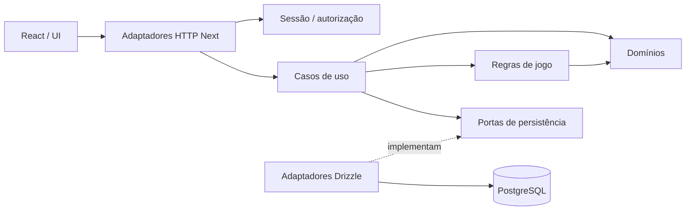

# Arquitetura técnica e stack

Data: 2026-09-16. Decisão aceita em [ADR-0001](../adr/ADR-0001-technical-stack.md), tarefa TASK-0002. Este documento define a direção técnica; não representa software implementado ou autorização de instalação.

## Requisitos e hipóteses

Produto web responsivo para desktop e celular, com contas reais e progressão persistente. Deve acomodar personagens, XP, níveis, atributos, inventário, equipamentos, missões, campanha bíblica cronológica, batalhas, chefes e conquistas. Ranking, social, administração e PWA são evoluções futuras.

Hipóteses de decisão: equipe pequena, preferência por TypeScript, orçamento inicial restrito e experiência centrada em menus, mapas navegáveis e batalhas por ações, sem simulação contínua ou multiplayer síncrono obrigatório. São hipóteses, não requisitos de gameplay aprovados. Experiência da equipe, orçamento numérico, volume de jogadores e SLA não foram informados; não se promete capacidade ou custo mensal. Essas lacunas não impedem a escolha documental, mas precisam de validação antes de dimensionar operação. Adoção de combate em tempo real exige reavaliar transporte e renderização.

Público etário, MVP, acessibilidade detalhada, traduções/licenças e tratamento das divergências cronológicas continuam pendentes. A plataforma web está definida. Nenhuma decisão aqui autoriza cadastro de pessoas ou publicação de conteúdo.

## Stack escolhida

| Área | Decisão | Motivo e limite |
| --- | --- | --- |
| Linguagem | TypeScript com modo strict | Contratos explícitos entre UI, aplicação e regras; tipos não substituem validação em runtime |
| Runtime | Node.js em linha LTS suportada | Um runtime para web e API; versão exata será fixada na preparação autorizada |
| Frontend/framework | React + Next.js App Router | Rotas, UI e endpoints no mesmo deploy; interatividade em componentes cliente, dados privados no servidor |
| Backend/API | Route Handlers Next.js, HTTP/JSON, runtime Node | Adaptadores finos sobre serviços de aplicação; sem segundo framework ou API separada inicialmente |
| Banco | PostgreSQL | Relações, integridade e transações adequadas à progressão persistente |
| ORM | Drizzle ORM + driver node-postgres; Drizzle Kit para futuras migrações | Acesso tipado próximo de SQL, transações explícitas; migrações deverão ser revisadas |
| Autenticação | Better Auth com adaptador Drizzle e sessões persistidas no PostgreSQL | Identidade e ciclo de sessão por biblioteca; autorização de jogo pertence à aplicação |
| Validação | Zod nas fronteiras | Validar contratos HTTP e configuração; invariantes de jogo permanecem no domínio |
| UI | HTML semântico, CSS Modules e tokens CSS com React | Responsividade e identidade visual sem kit adicional inicial; componentes acessíveis sob demanda |
| Game engine | Núcleo de regras em TypeScript puro | Independente de React, Next, ORM e renderização; servidor calcula estado oficial |
| Testes futuros | Vitest, React Testing Library, Playwright; integração com PostgreSQL descartável | Regras, UI, jornadas e integridade/concor­rência real; mocks não provam transações |
| Qualidade futura | TypeScript, ESLint e formatação consistente | Verificações reprodutíveis; regras de importação preservarão fronteiras |
| Organização futura | npm workspaces, um lockfile | Suficiente para apps/packages; sem Nx/Turborepo até necessidade medida |
| Cache futuro | Nenhum cache distribuído inicialmente; Redis candidato | Adotar somente por gargalo ou rate limiting distribuído; nunca autoridade da progressão |
| Storage futuro | Objetos compatíveis com API S3 | Para mídia crescente/uploads; começar com assets versionados e licenciados, sem serviço agora |
| Observabilidade | Logs JSON redigidos em stdout, IDs de correlação; OpenTelemetry para instrumentação futura | Medir latência, erros, saturação e disputas de transação; backend de telemetria ainda não contratado |
| Deploy | Um serviço Node em contêiner Linux e PostgreSQL gerenciado | PaaS com suporte a contêiner, TLS e backups; fornecedor/região definidos por orçamento e privacidade em tarefa futura |

A escolha é de tecnologias e topologia, não de versões instaláveis. Antes da primeira instalação autorizada, fixar releases estáveis compatíveis entre Node/Next/React, Drizzle/driver/Kit e Better Auth/adaptador; conferir suporte, licenças e avisos de segurança e registrar lockfile. Não adotar prereleases por padrão. Incompatibilidade real exige REWORK da preparação e, se alterar a decisão, novo ADR. Não existe auditoria de dependências sem versões e artefatos concretos.

## Comparação de opções

As avaliações abaixo são juízos arquiteturais para as hipóteses deste projeto, não benchmarks ou classificação universal de mercado.

| Opções | Benefícios | Custos/limitações | Decisão |
| --- | --- | --- | --- |
| Next.js integrado | Um deploy, mesma origem para sessão/API, componentes React e rotas integradas | Complexidade de cache e fronteiras servidor/cliente; atualizações do framework exigem atenção | Escolhido; SSR não é requisito do jogo, integração operacional é o motivo principal |
| React/Vite + API Node | SPA simples, backend com ciclo independente, boa opção para jogo muito interativo | Exige compor roteamento/API e operação de dois artefatos; mesma origem ainda seria possível via proxy | Alternativa viável se o MVP virar SPA dedicada ou exigir API independente |
| NestJS como API | Módulos e injeção estruturados, útil a equipes maiores | Segundo framework e mais convenções sem necessidade atual | Adiar; não é necessário para obter módulos internos |
| PostgreSQL | Integridade relacional e controle transacional para itens/recompensas | Administração, backups e custo mínimo do banco | Escolhido; dimensão operacional precisa ser medida |
| SQLite | Operação local simples | Exige cuidado adicional para escrita concorrente e múltiplas instâncias | Não escolhido como persistência de jogadores reais |
| Banco documental | Flexibilidade de documentos | Relações e invariantes deste domínio favorecem modelo relacional | Sem benefício que justifique trocar PostgreSQL |
| Drizzle | Modelo próximo de SQL, tipagem e controle explícito de consultas/transações | Exige conhecimento SQL e disciplina em migrações; maturidade/ecossistema menor que SQL direto | Escolhido para tornar persistência e concorrência visíveis |
| Prisma | Abstração de modelos e ferramentas produtivas, integração documentada com auth | Camada gerada e diferenças entre linhas de versão precisam ser acompanhadas; consultas críticas ainda exigem SQL | Alternativa válida; não instalar ambos |
| SQL direto com driver | Controle total, base consolidada | Mais trabalho para tipagem, mapeamento e migrações | Reservar SQL parametrizado a consultas justificadas dentro do adaptador |
| Better Auth | Integrações documentadas com Next e Drizzle, sessões controladas pela aplicação | Responsabilidade própria por atualização, recuperação de conta e operação; biblioteca relativamente recente | Escolhido com revisão de versões e configuração antes de uso |
| Provedor de identidade gerenciado | Pode reduzir operação de identidade | Dependência externa, custos por uso e decisões de privacidade | Reavaliar se equipe não puder operar auth; nenhum provedor contratado |
| Autenticação própria | Controle irrestrito | Custo e risco desnecessários de protocolos/criptografia | Rejeitada |
| CSS Modules vs Tailwind/kit de componentes | CSS nativo reduz dependências; utilitários/kits aceleram padrões recorrentes | CSS exige disciplina; kits introduzem convenções e customização | CSS Modules agora; medir necessidade de primitives acessíveis depois |

Maturidade e comunidade: React, Node e PostgreSQL oferecem bases amplamente estabelecidas; as camadas Next, Drizzle e Better Auth elevam produtividade, mas exigem acompanhamento de manutenção. Segurança depende de controles e atualização, não de popularidade. Desempenho depende de consultas, payloads e renderização medidos; nenhuma opção foi declarada mais rápida sem teste. Manutenção e produtividade favorecem uma linguagem e um deploy, pagando a complexidade do framework e SQL explícito.

Custo/hospedagem: o desenho reduz serviços iniciais a aplicação e banco, mas inclui gastos futuros com backups, tráfego e monitoramento. Escalabilidade começa com índices, pool de conexões, otimização e réplicas do mesmo monólito. Compatibilidade com desenvolvimento assistido por IA vem de tipos, módulos pequenos, documentação e testes; saída de IA exige revisão, sem presumir correção ou enviar dados pessoais/secrets a prompts. Adequação ao RPG vem de transações e regras testáveis, não de um framework especializado em jogos.

## Monólito modular e fronteiras

Um único deploy de aplicação e um banco lógico. `apps/` contém pontos de entrada; `packages/` contém bibliotecas internas, sem processos ou serviços de rede implícitos. A distribuição abaixo é conceitual; não criar estes arquivos nesta tarefa.

| Local futuro | Responsabilidade | Dependências permitidas |
| --- | --- | --- |
| apps/web | Next, composição, páginas, adaptadores HTTP e ligação de dependências | UI, contratos e módulos de servidor; código cliente só recebe exports seguros |
| packages/ui | Componentes de apresentação React | Contratos públicos; nunca banco, sessão privada ou serviços de servidor |
| packages/contracts | DTOs e validação de entrada/saída | Zod; sem entidades ORM ou secrets |
| packages/domain | Entidades conceituais, invariantes e políticas por domínio | TypeScript; sem infraestrutura |
| packages/game-engine | Cálculos e transições puras de regras | Tipos de domínio; sem relógio global, rede, banco ou UI |
| packages/application | Casos de uso e coordenação de módulos; portas de persistência | Domínio, engine e contratos; sem Next/Drizzle |
| packages/persistence | Adaptadores Drizzle, consultas e unidade de transação | Portas da aplicação, domínio e driver; acesso exclusivo do servidor |
| packages/auth | Adaptador Better Auth, sessão e identidade | Biblioteca de auth e infraestrutura de persistência; não calcula recompensas |

Diagrama conceitual:

Serviços de aplicação são chamadas internas, não microserviços. Cada módulo mantém suas operações públicas e propriedade de escrita; proibir imports de detalhes internos de outro módulo. A composição injeta os adaptadores. Domínio não importa aplicação, engine não importa persistência, e UI não importa servidor. Evitar dependências circulares; uma transação pode coordenar módulos via portas no mesmo processo. Não introduzir barramento, event sourcing, CQRS, repositório genérico ou pacote por entidade.

## Domínios e entidades previstas

Isto é um mapa de responsabilidades, sem schema, campos ou cardinalidades aprovados.

| Domínio | Entidades futuras e responsabilidade |
| --- | --- |
| Identidade | User: conta/sessão; Player: identidade de jogador ligada à conta, separada de credenciais |
| Personagem e progressão | Character, CharacterStats; XP, nível e atributos calculados/validados no servidor |
| Campanha e conteúdo | Campaign, Era, Region, Chapter, Mission; ordenação narrativa explícita e versionamento editorial |
| Missões do jogador | MissionProgress; pré-requisitos, estado e recebimento único de recompensas |
| Combate | Battle, Enemy, Boss; regras e histórico oficial de resultados; decidir depois se Boss especializa Enemy |
| Itens e equipamento | Item, Inventory, Equipment; catálogo separado da posse; equipar/consumir via invariantes transacionais |
| Conquistas | Achievement; critérios e concessões persistentes; relação de concessão definida na modelagem |

Campanha distingue conteúdo publicado da progressão individual. Classificar conteúdo como CANONICAL com origem, INTERPRETATIVE ou FICTIONAL, conforme política existente. Ordem cronológica editorial não afirma consenso onde há divergência. Não definir narrativas ou licenças nesta tarefa. Ranking futuro lê projeções da progressão oficial; social e administração ganham módulos somente quando aprovados. RBAC administrativo não concede automaticamente acesso a qualquer personagem.

## Renderização e game engine

| Abordagem | Adequação | Custo | Resultado |
| --- | --- | --- | --- |
| React/DOM e CSS | Menus, fichas, inventário, missões, mapas por pontos e batalhas por ações | Não é loop de simulação para muitos sprites | Escolhida inicialmente, com teclado, toque, foco e layouts responsivos |
| Canvas direto | Desenho frequente e cenas próprias | Implementar interação, acessibilidade, câmera e gestão de assets | Adiar até demonstração de necessidade |
| Phaser | Cenas 2D, sprites, animação e câmera; renderização Canvas/WebGL documentada | Bundle, ciclo de vida e camada acessível adicional; integração com React | Sem justificativa agora |
| Híbrida React + cena gráfica | UI semântica com mapa/batalha visual especializada | Sincronização entre estado e cena, duas camadas de interação | Evolução preferida se necessidade gráfica aparecer |

O termo game engine significa aqui núcleo de regras, não engine gráfica. Compartilhar tipos e regras inofensivas para previews é permitido; estado privado, aleatoriedade oficial e concessões ficam no servidor. Injetar aleatoriedade e tempo em cálculos para testes reproduzíveis. Renderer futuro consome snapshots/eventos aprovados e emite intenções, preservando regras independentes.

Gatilho para reavaliar Phaser/Canvas: MVP aprovado exigir movimento contínuo, câmera, colisões ou volume de sprites que não atinja o orçamento de desempenho em celulares alvo. Fazer protótipo comparativo apenas em tarefa autorizada, medir memória, carregamento e fluidez; estética desejada sozinha não impõe engine.

## Autoridade, persistência e segurança

Fluxo futuro: intenção do cliente → validar payload e sessão → autorizar dono/recurso/ação → carregar estado oficial → avaliar regras → persistir atomicamente → retornar DTO mínimo. Cliente não define XP, nível, inventário, recompensas, resultado de batalha ou progressão. Uma intenção como concluir missão não prova cumprimento: servidor verifica pré-requisitos e eventos oficiais.

Para concluir batalha ou conceder recompensa, atualizar estado e concessão na mesma transação. Usar chave idempotente vinculada ao ator/operação, restrição de unicidade e controle de concorrência (versão/atualização condicional ou bloqueio, conforme modelagem). Repetir requisição ou enviar comandos paralelos não pode duplicar itens/XP. Escolher isolamento por caso de uso e tratar conflitos com retry limitado; uma transação no isolamento padrão não resolve toda disputa automaticamente. Essas são exigências para implementação e testes, não mecanismos existentes.

Controles obrigatórios antes de disponibilizar contas/jogo:

- Sessões revogáveis no banco; cookies HttpOnly, Secure em HTTPS e SameSite adequado. Não guardar credenciais de sessão em localStorage. Definir expiração, recuperação e verificação de conta em tarefa própria.
- Autorizar cada caso de uso no servidor; negar por padrão, verificar propriedade mesmo com sessão válida e manter futura política RBAC separada. Middleware e esconder botões não bastam.
- Preservar verificações de origem/CSRF da biblioteca e aplicar proteção equivalente às mutações de gameplay. GET não muda estado. Respostas pessoais não entram em cache público/compartilhado.
- Zod valida forma, tamanho e limites; domínio valida legalidade da ação. Usar consultas parametrizadas, saídas codificadas e conteúdo editorial sanitizado se aceitar HTML. Não interpolar SQL/comandos a partir de entrada.
- Rate limiting será implementado antes da exposição pública de login e mutações, com limites por conta/IP/ação e tamanho de payload. Em múltiplas réplicas, contador compartilhado; confiar apenas nos headers definidos pelo proxy controlado. Limites da biblioteca de auth não protegem automaticamente API de jogo.
- Secrets em armazenamento de ambiente apropriado, nunca exportados ao cliente, versionados ou registrados. Banco com menor privilégio; credencial de migração separada da execução quando implementado.
- Logs sem tokens, cookies, senhas, corpos de login ou dados pessoais desnecessários; erros externos sem stack trace. Telemetria com retenção e acesso restritos.
- Definir público etário, minimização/retenção e requisitos de privacidade antes de cadastro/social. Antes de produção, testar backup/restauração e acesso administrativo; antes de uploads, revisar tipo/tamanho, autorização e publicação de objetos.

## Testes e operação futuros

Vitest cobre invariantes, cálculo de progressão e transições com RNG controlado. Integração usa PostgreSQL real descartável para rollback, concorrência, idempotência e autorização entre jogadores. React Testing Library cobre interação sem depender da estrutura interna; Playwright cobre login, missão, batalha e recompensa em desktop/celular, teclado e falhas de rede. Não há testes executáveis nesta entrega documental.

Deploy recomendado: processo Node persistente, assets estáticos servidos eficientemente e PostgreSQL gerenciado com pool limitado por instância. Next suporta deploy Node/contêiner; não depender exclusivamente de um provedor. Export estático não atende endpoints/sessões. Evitar Edge runtime inicialmente para manter compatibilidade com persistência e auth. PaaS gerenciado reduz operação de hosts; VPS oferece controle, mas transfere patching, backups e disponibilidade à equipe. Serverless continua alternativa, com avaliação específica de conexões, execução e custos.

Logs e métricas devem permitir detectar latência p95, erros, falhas de auth e conflitos de escrita sem dados sensíveis. Instrumentação OpenTelemetry no servidor facilita futura exportação; escolher backend, amostragem e retenção só quando houver operação autorizada. Não provisionar collector ou plataforma nesta fase.

PWA futura pode oferecer instalação e cache de assets públicos; não prometer progressão offline. Service worker não deve cachear sessão nem respostas privadas. Retomada de rede deve revalidar estado e impedir reaplicação de comandos. Sem service worker agora.

Evolução: medir consultas/índices antes de cache; escalar instâncias do mesmo monólito antes de separar serviços. Redis, storage S3 e jobs entram por necessidade comprovada. Extração de módulo exige fronteira estável e justificativa de escala, isolamento ou equipe; tamanho do diretório não basta. Alta disponibilidade, tráfego e orçamento serão dimensionados com dados reais.

## Trade-offs e próximos passos

A escolha reduz operação inicial e preserva regras testáveis, mas aceita acoplamento da borda ao Next, dependência de bibliotecas em evolução, conhecimento SQL e responsabilidade por auth. Módulos e um deploy único não asseguram disciplina sozinhos; futuras verificações de imports e testes devem sustentá-la. Desempenho, segurança implementada e compatibilidade de versões permanecem não demonstrados nesta fase.

Próxima tarefa recomendada: TASK-0003, definir público/MVP, interação das batalhas, privacidade, acessibilidade e limites editoriais/licenças, apenas documental. Depois, modelagem conceitual dos dados e contratos transacionais. Não iniciar schema, scaffolding ou configuração externa antes de autorização específica.

## Fontes primárias consultadas em 2026-09-16

As fontes fundamentam capacidades; a seleção e os trade-offs são avaliação do projeto. Nenhum comando de instalação presente nessas páginas foi executado.

- [Next: deploy Node e contêiner](https://nextjs.org/docs/app/getting-started/deploying), [autenticação](https://nextjs.org/docs/app/guides/authentication) e [PWA](https://nextjs.org/docs/app/guides/progressive-web-apps).
- [React: componentes e interação](https://react.dev/learn), [Vite](https://vite.dev/guide/), [NestJS](https://docs.nestjs.com/) e [ciclo Node.js](https://nodejs.org/en/about/previous-releases).
- [PostgreSQL: isolamento](https://www.postgresql.org/docs/current/transaction-iso.html), [Drizzle: abordagem](https://orm.drizzle.team/docs/overview) e [transações](https://orm.drizzle.team/docs/transactions).
- [Prisma: referência de transações da linha v7](https://docs.prisma.io/docs/orm/v7/prisma-client/queries/transactions). A referência não comprova compatibilidade de futuras versões; não se selecionou uma versão Prisma.
- [Better Auth: sessões](https://better-auth.com/docs/concepts/session-management), [segurança](https://better-auth.com/docs/reference/security), [adaptador Drizzle](https://better-auth.com/docs/adapters/drizzle) e [integração Next](https://better-auth.com/docs/integrations/next).
- [Zod](https://zod.dev/), [Vitest](https://vitest.dev/guide/), [Playwright](https://playwright.dev/docs/intro) e [OpenTelemetry JavaScript](https://opentelemetry.io/docs/languages/js/).
- [Phaser: documentação oficial](https://docs.phaser.io/).
