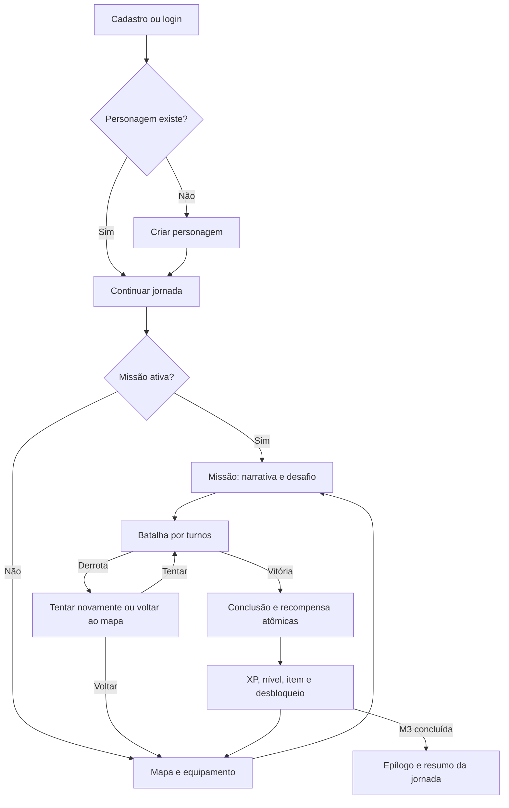

> SUPERSEDED — histórico da TASK-0003. Não rege o produto atual. Ver [MVP vigente](../MVP.md), TASK-0006.

# Core gameplay loop

Design v1, TASK-0003. Uma ação relevante produz resposta visual, progresso confirmado e um próximo objetivo claro.

## Ritmo e escolhas

Mapa com três nós conectados, estado bloqueado/disponível/concluído, objetivo curto e recompensa prevista. Só um nó principal disponível por vez. O jogador controla quando avançar, equipar proteção, consultar referência e tentar outra estratégia de combate. Não existe exploração livre: descobrir o próximo nó e seu contexto fornece a progressão visual. Oferecer lista equivalente para teclado/leitor de tela.

Missão alterna cena curta, desafio interativo e batalha, evitando longos blocos de leitura. Diálogos ficcionais têm duas respostas de tom sem mudar acontecimentos ou recompensa. Cenas já vistas podem ser aceleradas; a etiqueta editorial continua visível. Não há teste de religiosidade, obrigação de memorizar versículos, penalidade por abrir referência ou recompensa por uma opinião teológica.

## Estados e concessão

M1 começa AVAILABLE; M2/M3 LOCKED. Iniciar missão elegível: AVAILABLE → ACTIVE, etapa NARRATIVE → CHALLENGE → BATTLE. Cena tem cursor confirmado; desafio guarda conclusão; batalha guarda estado completo por rodada. Resultado de derrota fica na tentativa encerrada, mantendo missão ACTIVE para nova tentativa. Voltar ao mapa encerra a missão ativa e a deixa AVAILABLE para reinício.

Vitória: ACTIVE → COMPLETED. A mesma transação confirma fim da batalha, conclusão, XP, nível derivado, item quando houver e desbloqueio. M1 libera M2; M2 libera M3; M3 marca capítulo/campanha do slice concluídos. Não há botão que precise ser clicado para conceder prêmio: a tela apenas exibe um recibo já persistido. Boss não concede uma segunda recompensa além de M3.

Missões COMPLETED permitem consultar resumo/narrativa, sem reiniciar combate ou receber XP novamente. Não há missão seguinte vazia após M3: epílogo informa que o recorte terminou. Conteúdo futuro não aparece como obrigação inacessível.

## Autosave e retomada

Servidor confirma cada avanço de cena, desafio, rodada, equipamento e criação. UI distingue salvando/salvo/sem conexão. Só avança após confirmação; animação pode ser repetida, ação de jogo não. Ao entrar, continuar busca o snapshot oficial. Conteúdo de uma tentativa fica vinculado à versão de regras/editorial com que começou; publicação futura não recalcula uma batalha aberta.

Intenção tem ID único por operação e versão esperada. Servidor vincula ID a conta, recurso e conteúdo da intenção; repetir ID com conteúdo diferente é rejeitado. Resposta perdida: reenviar mesma intenção/ID ou consultar snapshot/recibo, nunca gerar automaticamente nova rodada. Duas abas sobre a mesma versão: uma vence, outra recebe conflito e atualiza estado, sem executar silenciosamente a ação sobre a versão nova.

Concessão única por personagem/missão e criação única por conta são invariantes persistentes. Erro antes do commit mantém estado anterior; erro de resposta após commit retorna o recibo na consulta seguinte. Se sessão expirar, autenticar novamente e recuperar estado antes de enviar ações. Sem rede, pausar mutações e permitir apenas leitura do que já está exibido; sem fila offline ou cache persistente de dados privados.

## Cenários de aceite

| Situação | Resultado esperado |
| --- | --- |
| Conta sem personagem seleciona Continuar | Fluxo de criação, sem acesso a missão ainda |
| Tentar M3 antes de concluir M2 | Rejeição no servidor, mapa permanece coerente |
| Resposta errada no desafio | Dica e nova tentativa sem XP/vida perdidos |
| Fechar aba após rodada confirmada | Retoma vida/rodada/habilidade exatas |
| Vitória com resposta perdida | Recibo reaparece; XP e item concedidos uma vez |
| Duplo clique e duas abas | Não duplicam turno, personagem ou prêmio |
| Alterar dono/XP/dano pelo cliente | Operação rejeitada; dados de terceiro não expostos |
| Derrota no boss | XP 200 preservado; tentar novamente reinicia E3 sem repetir desafio |
| M3 concluída | XP 300, nível 3, I3 e epílogo; consulta posterior não paga prêmio |

São cenários de teste futuro e revisão documental atual, não testes de software executados.

